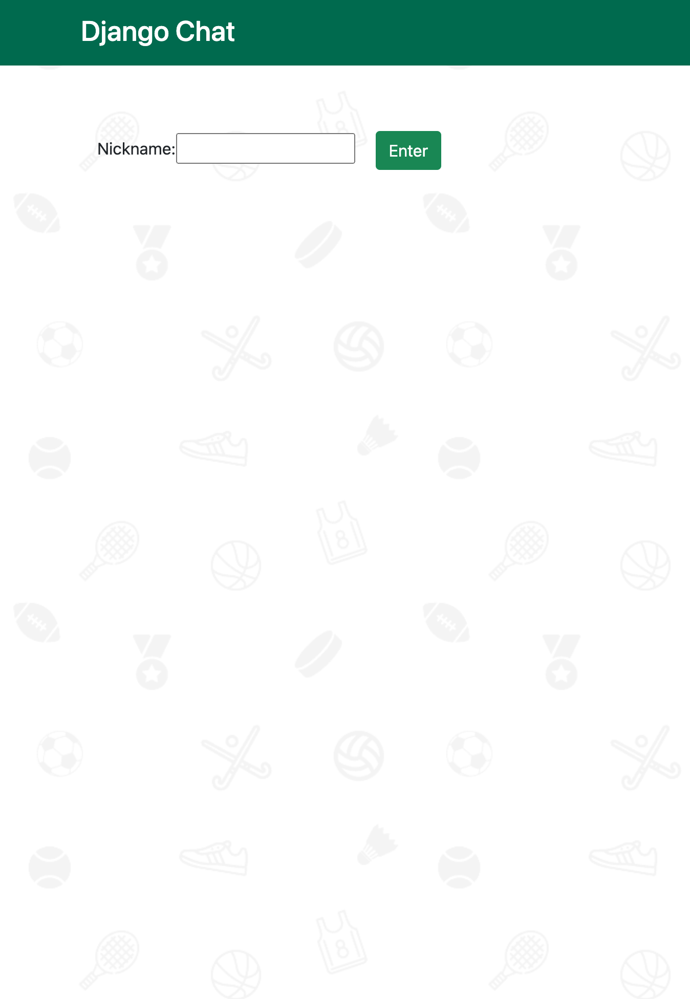
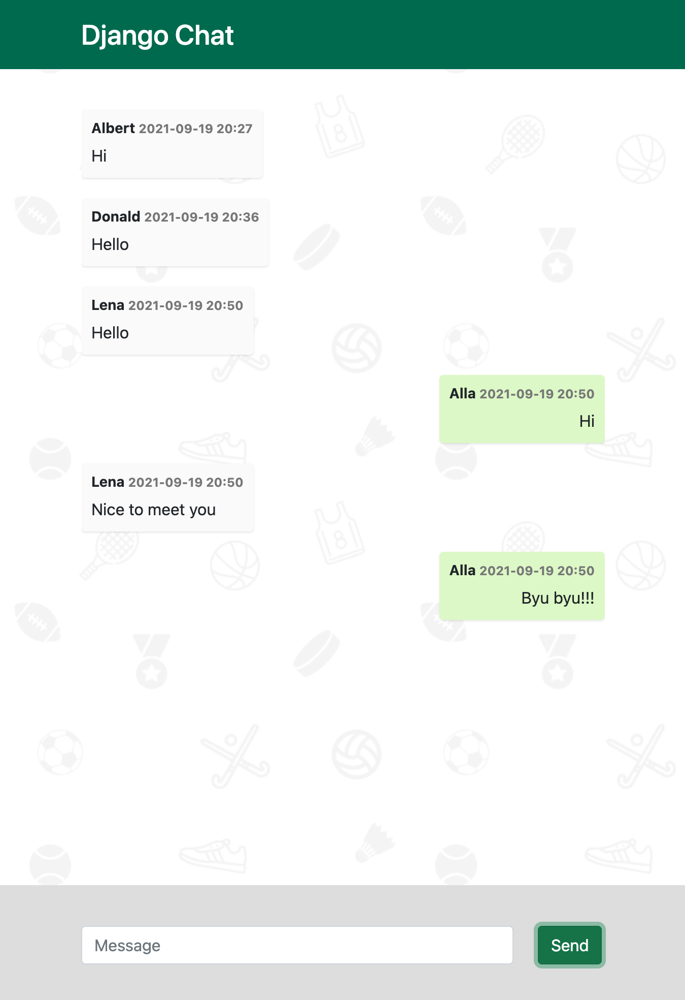

# Django-chat

### Install
- `git clone https://github.com/migenru/django-chat.git`
- `cd django-chat`
- `docker-compose up --build`
- open in your browser http://127.0.0.1/

### Stack
- Django
- Postgres
- Redis

### Screens
#### First screen

#### Second screen
